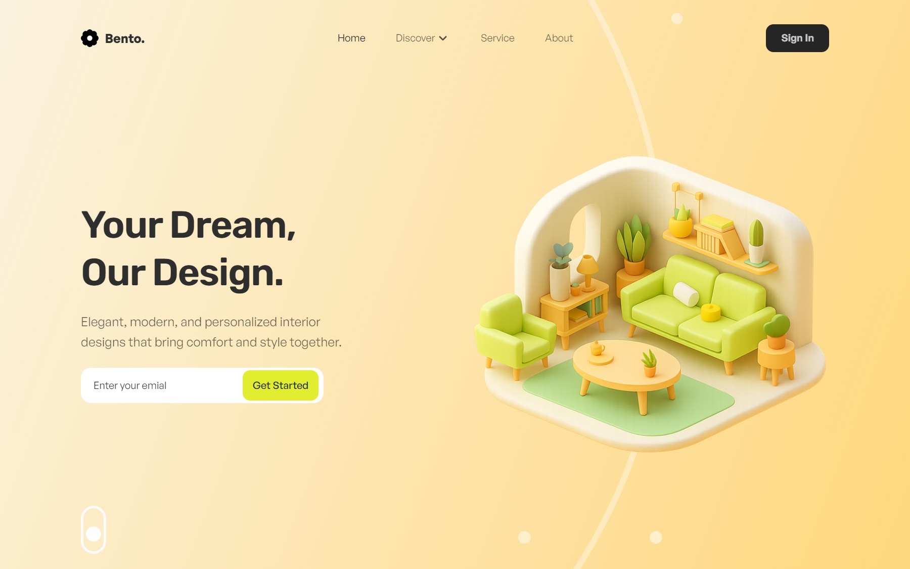

# Bento - Figma to Frontend

#
- ✨ Modern & Minimal Hero Layouts
- 🎨 Clean Landing Page UI
- 🚀 Figma to Frontend: Hero Sections

## 🛠️ Tecnologías utilizadas

  
Vite

  
Vue

  
TypeScript 

  
TailwindCSS 

  
Figma Community (diseño base) 

## 🙌 Créditos
- **Diseño original:** [dsingr](https://www.figma.com/@dsingr) en Figma Community  
- **Archivo de diseño:** [Ver en Figma](https://www.figma.com/community/file/1572184858610540593/how-ui-ux-designers-work-full-ui-design-process-in-figm-tips-and-tricks)  
- **Implementación frontend:** Luis Arteaga(este repositorio)

